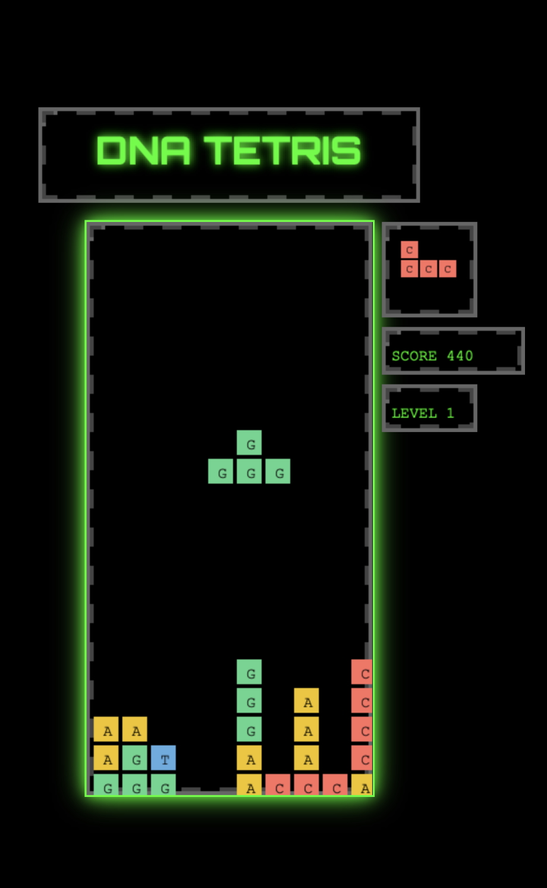

# DNA-TETRIS
A unique twist on the classic Tetris game, blending the mechanics of falling blocks with the science of DNA base pairing and methylation.




---

## Table of Contents
- [Game Concept](#game-concept)
- [Link to Genetics](#link-to-genetics)
- [How to Play](#how-to-play)
- [Keyboard Controls](#keyboard-controls)
- [Installation](#installation)

---

## Game Concept

"DNA Tetris" reimagines Tetris by incorporating elements of molecular biology. Instead of just stacking blocks to clear lines, players arrange falling pieces labeled with DNA bases (A, T, C, G) and a special Methylation (M) piece. The goal is to create complementary base pairs (A-T, C-G) to score points, while the M piece introduces a disruptive twist inspired by epigenetic modifications. The game combines strategic block placement with a biological twist, making it both educational and entertaining. It was built as a collaborating effort betwwen Grok 3 AI (Tetris game structure) + Oliveira Lab (logic of DNA base complementarity + methylation implementation).

---

## Link to Genetics

In biology, DNA is composed of four nucleotide bases:
- **Adenine (A)** pairs with **Thymine (T)**.
- **Cytosine (C)** pairs with **Guanine (G)**.

These base pairs form structure of the DNA double helix. In "DNA Tetris":
- Pieces are assigned one of these bases (A, T, C, G) or the special M base.
- When complementary bases (A-T or C-G) land adjacent to each other (horizontally or vertically), they clear, simulating the bonding in DNA.
- The **Methylation (M) piece** reflects the real-world process of DNA methylation, where a methyl group attaches to a base affecting gene expression. In the game, it clears surrounding pieces, mimicking its disruptive role in genetics.

This gamified approach introduces players to basic genetic concepts while maintaining the addictive gameplay of Tetris.

---

## How to Play

1. **Objective**: Stack falling pieces to form complementary base pairs (A-T, C-G) and clear them for points. Avoid letting the stack reach the top.
2. **Scoring**:
   - Complementary pair (A-T or C-G): 10 points.
   - Methylation (M) piece (with a 10% spawn chance) clearing surrounding blocks: 5 points per block.
   - Clearing an empty row: 20 points.
3. **Leveling**: The game speeds up as your score increases (every 2500 points), maxing out at Level 15.
4. **Game Over**: The game ends if a new piece cannot spawn due to a full grid.

---

## Keyboard Controls

| Key           | Function                          |
|---------------|-----------------------------------|
| **Arrow Left** | Move piece left                  |
| **Arrow Right**| Move piece right                 |
| **Arrow Down** | Move piece down faster           |
| **Shift**      | Rotate piece (except M piece)    |
| **P** or **p** | Toggle pause                     |

---

## Installation

1. **Clone the Repository**:
   ```bash
   git clone https://github.com/oliveira-lab/dna-tetris.git
